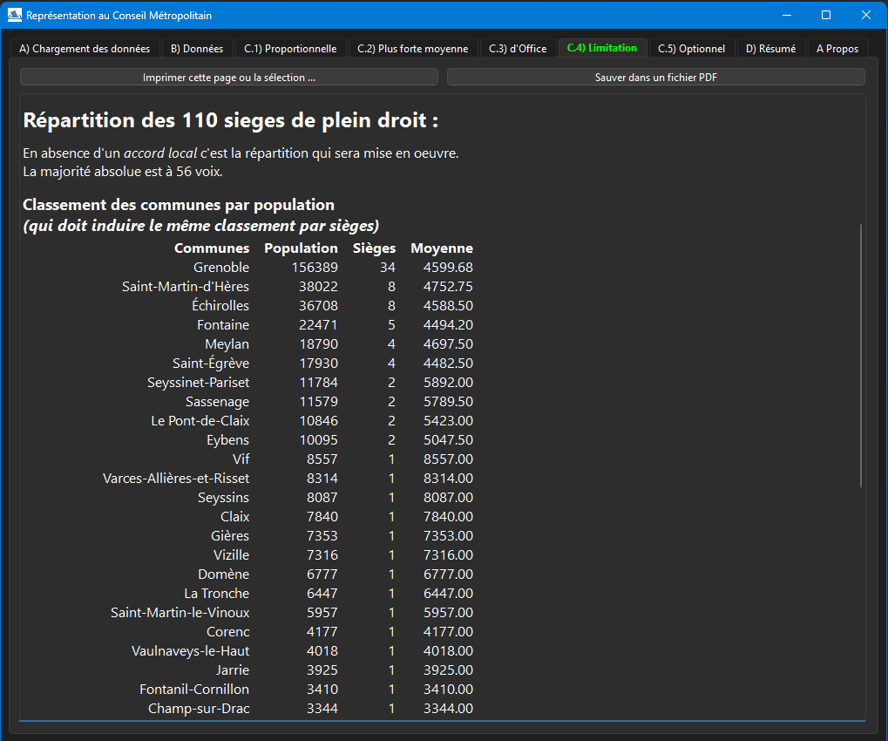
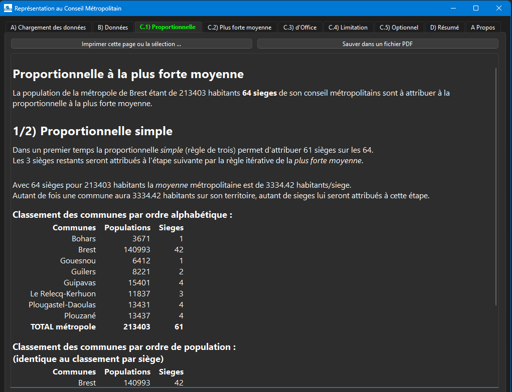
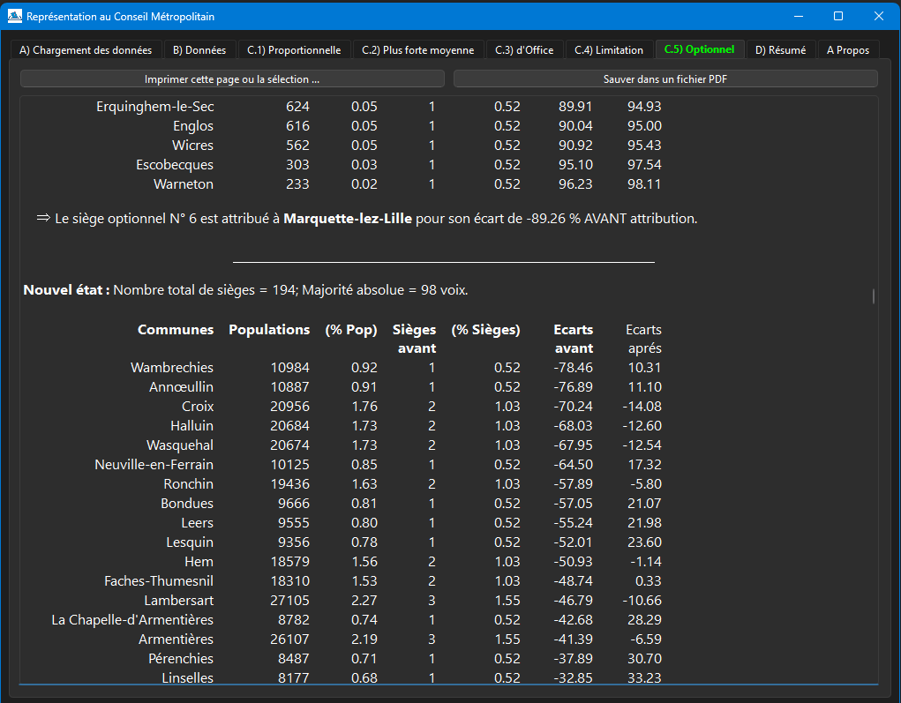

### *Représentation à un Conseil Métropolitain*
<br/>
<br/>
<br/>

# PRESENTATION
Ce programme (Conseil-Metropolitain.exe) permet d’effectuer l'attribution des sièges
d’un conseil métropolitain aux communes membres d’une **métropole**. Il est donc une
implémentation de l’article **[L5211-6-1](https://www.legifrance.gouv.fr/codes/article_lc/LEGIARTI000034116583)**
du **C**ode **G**énéral des **C**ollectivités **T**erritoriales (CGCT).
Ce texte de loi attribue les sièges plus ou moins proportionnellement à la population
de chaque commune ce qui requiert pas mal de calculs, surtout quand le nombre de
communes est important.

Chaque étape du processus d’attribution des sièges est expliquée et décortiquée en
détail avec les résultats intermédiaires à l’appui (voir les copies d'écran en fin de page).
Le détail de chaque étape peut être imprimé ou sauvé dans un fichier pdf.

Le programme inclue les données de **[l’Insee](https://www.insee.fr/fr/statistiques)**
certifiés pour les élections municipales de 2020 (données 2019) et de 2026
(données 2025). Mais des fichiers csv peuvent être chargés pour faire des
simulations/projections.

# LIMITATIONS
Il y a actuellement [22 métropoles](https://fr.wikipedia.org/wiki/M%C3%A9tropole_(intercommunalit%C3%A9_fran%C3%A7aise))
en France : ~~Aix-Marseille~~, Bordeaux, Brest, Clermont-Ferrand, Dijon, Grenoble, Lille, ~~Lyon~~,
Metz, Montpellier, Nancy, Nantes, Nice, Orléans, Paris, Rennes, Rouen, Saint-Etienne,
Strasbourg, Toulon, Toulouse et Tours.

- A cause d'exceptions au cas général (réclamées par Jean-Claude Gaudin),
la métropole d'Aix-Marseille n'est pas supportée par ce programme.
- La métropole de Lyon ne relève pas de l'article L5211-6-1 et n'est donc pas supportée.

# AVERTISSEMENT
La derrière partie du processus d’attribution des sièges, parfois appelé *'accord local'*,
donne un certain degré de liberté dans l’attribution optionnelle de sièges supplémentaires.
Ce programme propose deux algorithmes pour éventuellement faire ces attributions, **mais
d’autres méthodes arithmétiques et/ou politiques sont envisageables** tant qu’elles respectent le cadre
légal et en particulier les recommandations du Conseil Constitutionnel (qui sont rappelées
par le programme).

# AIDE / WIKI
Le **[Wiki](https://github.com/JEAYNE/Conseil-Metropolitain/wiki)** couvre beaucoup
de sujets et est trés régulièrement mis à jour :
- Procédures d'installation / mise à jour / désinstallation.
- Utilisation du programme.
- Les [concepts-clés](https://github.com/JEAYNE/Conseil-Metropolitain/wiki/Concepts) :
Représentativité, plus forte moyenne, calculs AVANT/APRES attribution ...
- Information sur les données utilisées par le programme et comment utiliser
vos propres données.

# NOTE pour les profanes...
Vous êtes peut-être étonnés de n'avoir jamais entendu parler d’élections pour les
personnes qui siègent à ce conseil métropolitain. C’est normal ! Il s’agit d’une
élection jumelée aux élections municipales. Certains conseillers municipaux de
votre commune (ils sont indiqués sur le bulletin de vote) iront siéger au conseil
métropolitain, en plus du conseil municipal de la commune.

Pour chaque commune le nombre de ces conseillers municipaux à double casquette est
définit par l'article L5211-6-1 du CGCT et est l’objet principal de ce programme.
Il dépend principalement de la part que représente la population de la commune par
rapport à l'ensemble des communes de cette métropole.

# CODE SOURCE

TOUT est open-source : les outils et le programme final.

- Le programme ```Conseil-Metropolitain.exe``` est écrit en C++ avec le framework
[Qt](https://www.qt.io/product/qt6) 6.8 et compilé avec
[MinGW](https://www.mingw-w64.org/) (fournit avec Qt)
- Le programme d'installation pour Windows est aussi créé avec le framework Qt.
- Une fois tous les 6 ans (!), un script [Perl](https://strawberryperl.com/)
fusionne des données publiées par l'Insee pour
produire un fichier CSV par métropole, que le programme ```Conseil-Metropolitain.exe```
utilise (voir le répertoire ```insee```).

# BUGS

En cas de suspicion ou découverte d'un bug, ou pour tout autre problème ou remarque, merci
d'ouvrir une discussion (en Français or in English) dans le système de
[gestion de bug](https://github.com/JEAYNE/Conseil-Metropolitain/issues).

# COPIES D'ECRAN

Note: le thème clair/sombre suit celui de Windows.






